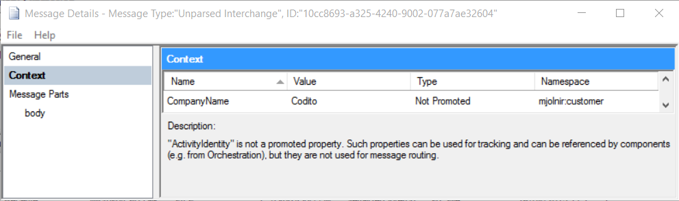

BizTalk\<Extended\>
======================
_"BizTalk\<Extended\>"_ is an open-source project that will take your BizTalk development to the next level.

# Features at a glance
BizTalk<Extended\> offers the following features:

- Typed interaction with the message context

## Planned features
- Generic pipeline component

For a full list of the planned features, have a look at the `feature`-issues [here](https://github.com/CoditEU/Mjolnir/labels/feature).

# Usage
## Typed interaction with message context
Fixed strings in code are evil and should be avoided at all times when possible to prevent typos, especially when interacting with the message context.

We provide you the tools to specify the type of your property and handle it all for you. You can use your own custom property schemas or existing BizTalk schemas.

To interact with these BizTalk schemas you'll need to reference `Microsoft.BizTalk.GlobalPropertySchemas.dll` that contains all the types.
You can find it here:
> C:\Program Files (x86)\Microsoft BizTalk Server 2013 R2\Microsoft.BizTalk.GlobalPropertySchemas.dll

### Writing & Promoting

	message.WriteContextProperty<WCF.Action>("Send");

TBW

	message.PromoteContextProperty<WCF.Action>("Send");

It also works with your custom property schemas. Here we will write *Codito* as `CompanyName` in our `Customer` schema.

	message.PromoteContextProperty<Customer.CompanyName>("Codito");

When we look at the tracking you see that it automagically retrieves the namespace and writes the value to the context

You're not limited to strings, you can also pass in enumerations and we'll handle it!

	message.PromoteContextProperty<Customer.SupportPlan>(SupportPlan.FirstLine);

### Reading

	string action = message.ReadContextProperty<WCF.Action, string>();

TBW

	string action = message.ReadContextProperty<WCF.Action, string>(isMandatory: false);

# Requirements
In order to use this library you should meet these requirements:

- BizTalk 2013 R2 or higher
- Visual Studio 2013 or higher
- .Net Framework 4.5 or higher

# License
This project is licensed under the [MIT license](LICENSE).

